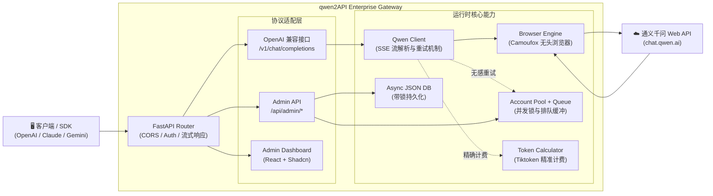

# qwen2API Enterprise Gateway

将通义千问（chat.qwen.ai）网页版 Web 对话能力转换为 OpenAI、Claude 与 Gemini 兼容 API。后端为 **Python (FastAPI) 全量实现** ，前端为基于 React + Shadcn 构建的管理台。

## 架构概览

qwen2API 2.x（模块化重构版）



- **后端**：Python (FastAPI + Uvicorn + Camoufox)
- **前端**：React + Vite + Shadcn UI 管理台
- **部署**：本地跨平台脚本运行、支持后台守护进程

### 2.X 底层架构调整（相较旧版本）

- **模块化解耦**：将原单文件脚本拆分为 `core/`（引擎与并发锁）、`services/`（大模型客户端与计费）、`api/`（路由层），极大提升可维护性。
- **无感容灾重拨**：当某个上游账号被限流（Rate Limit）或 Token 失效时，底层拦截请求并自动更换健康账号重试，保障下游请求成功率。
- **并发防洪缓冲堤**：面对瞬时高并发，请求自动进入等待队列，超过等待阈值优雅返回 `429 Too Many Requests`，保护浏览器引擎免于崩溃。
- **冷酷的精算师**：内嵌 `tiktoken` 强制计算 Prompt 与 Completion 的精确 Token，实现对下游用户的精准额度扣减。
- **异步安全锁**：配置文件（`accounts.json`、`users.json`）全面引入异步读写锁，杜绝高并发下的数据损坏。
- **Shadcn 纯后台面板**：前端重构为极简暗黑风仪表盘，提供全局并发监控、上游账号状态、下游 Token 分发与额度管理。

## 核心能力

| 能力 | 说明 |
|---|---|
| OpenAI 兼容 | `POST /v1/chat/completions` (支持流式增量输出与完整字段返回) |
| 多账号并发轮询 | 支持多账号并发执行，内建负载均衡与失败剔除机制 |
| 无感容灾重试 | 上游账号不可用时自动切换健康账号重新发起请求 |
| 并发队列控制 | 引擎级并发槽位 + 等待队列，动态防洪 |
| Token 精确计费 | 集成 `tiktoken` (cl100k_base) 实时计算消耗，支持租户额度控制 |
| 浏览器指纹伪装 | 基于 `camoufox` 引擎，绕过常规自动化检测，保障请求稳定性 |
| Admin API | 提供账号增删、引擎状态查询、下游用户 Token 签发与额度管理 |
| WebUI 管理台 | 基于 Shadcn 构建的极暗风数据大盘，直观掌控全链路运行状态 |

## 模型支持

接口内置了完善的模型名称映射机制，主流调用参数均可被安全路由至千问最佳模型：

| 客户端传入模型名 | 实际映射目标模型 |
|---|---|
| `gpt-4o` / `gpt-4-turbo` / `o1` / `o3` | `qwen3.6-plus` |
| `gpt-4o-mini` / `gpt-3.5-turbo` / `o1-mini` | `qwen3.5-flash` |
| `claude-3-5-sonnet` / `claude-opus-4-6` | `qwen3.6-plus` |
| `claude-3-haiku` | `qwen3.5-flash` |
| `gemini-2.5-pro` | `qwen3.6-plus` |
| `deepseek-chat` / `deepseek-reasoner` | `qwen3.6-plus` |

*提示：推理能力（如 thinking_enabled）已在负载层动态配置，具体行为视系统版本及配置而定。*

## 快速开始

### 前置要求

- Python 3.10+
- Node.js 18+ (用于构建与运行前端管理台)

### 本地运行

1. **克隆仓库与安装依赖**

```bash
git clone https://github.com/YuJunZhiXue/qwen2API.git
cd qwen2API

# 安装后端依赖
cd backend
pip install -r requirements.txt
python -m camoufox fetch  # 首次需下载浏览器内核

# 安装前端依赖
cd ../frontend
npm install
cd ..
```

2. **初始化配置**

首次运行前，请确保设置了必要的环境变量或直接在系统中管理生成的 `data/accounts.json`。
默认管理员密钥为 `admin`（可在代码中修改）。

3. **一键启动**

使用项目根目录提供的跨平台点火脚本：

```bash
python start.py
```

启动后，系统将自动唤醒后端引擎与前端面板：
- **管理中枢 (Frontend)**：`http://localhost:5173`
- **API 接口 (Backend)**：`http://localhost:8080`

按下 `Ctrl+C` 即可安全终止所有关联进程。

### 配置说明

系统核心状态存储于 `data/` 目录下（由程序自动生成与维护）：
- `data/accounts.json`：存放上游千问账号的登录凭证与状态。
- `data/users.json`：存放签发给下游调用的 API Key 及 Token 消耗统计。

你可以通过前端 Dashboard 可视化管理这些配置，无需手动编辑 JSON 文件。
