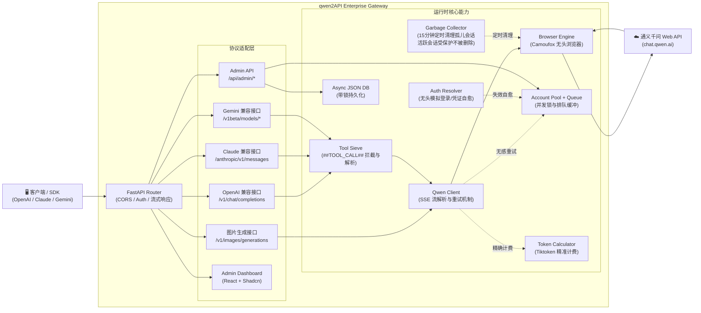

# qwen2API Enterprise Gateway

[](https://github.com/YuJunZhiXue/qwen2API/blob/main/LICENSE)
[](https://github.com/YuJunZhiXue/qwen2API/stargazers)
[](https://github.com/YuJunZhiXue/qwen2API/network/members)
[](https://github.com/YuJunZhiXue/qwen2API/releases)
[](https://hub.docker.com/r/yujunzhixue/qwen2api)

[](https://zeabur.com/templates/qwen2api)
[](https://vercel.com/new/clone?repository-url=https%3A%2F%2Fgithub.com%2FYuJunZhiXue%2Fqwen2API)

语言 / Language: [中文](./README.md) | [English](./README.en.md)

将通义千问（chat.qwen.ai）网页版 Web 对话能力转换为 OpenAI、Claude 与 Gemini 兼容 API。后端为 **Python (FastAPI) 全量实现**，不依赖其他运行时；前端为基于 React + Shadcn 构建的管理台，提供现代化的 Slate/Indigo 暗黑主题交互面板。

---

## 架构概览

qwen2API



- **后端**：Python (FastAPI + Uvicorn + Camoufox 无头引擎)
- **前端**：React + Vite 6 + Shadcn UI 管理台
- **部署**：支持本地脚本启动、Docker 容器化部署、Zeabur 一键托管、Vercel 代理等方案

### 核心特性与架构升级

- **全协议原生适配**：原生提供对 OpenAI (`/v1/*`)、Anthropic (`/anthropic/v1/messages`) 与 Gemini (`/v1beta/models/*`) 接口的深度转换。
- **Tool Calling (工具调用) 与 CoT 记忆链**：针对千问网页版缺乏原生 Function Calling 的缺陷，植入底层的 Prompt 劫持与流式文本剥离机制。完美支持 OpenAI SSE 流式规范（严格遵循 `role` -> `tool_calls` -> `finish` 组装顺序），并在历史上下文中自动持久化模型的思考过程（Reasoning Text），完美兼容 OpenClaw、Claude Code 等高阶 Agent 框架的多轮复杂调度。
- **JSON 异常自愈网络**：内置强制纠错回调。当大模型在长文本中输出非法的 JSON 结构（如未转义的换行符或引号）时，解析层会拦截异常并向外抛出带有修正提示的伪造 Tool Call，利用外部客户端的自动重试机制逼迫模型自愈。
- **无感容灾重拨与账号轮询**：当某个上游账号被限流（Rate Limit）或发生 Token 异常时，底层拦截器会挂起当前请求，并自动从并发池中抓取健康账号重试，全程对下游 SDK 透明。
- **Aliyun WAF 绕过与凭证自愈引擎**：探针层引入真实浏览器指纹与 Header 伪装，完美绕过阿里云 WAF 的静态请求拦截。当遇到账号被封禁、待激活或凭证过期（HTTP 401/403）时，系统会自动在后台调度无头浏览器执行自动邮件读取、点击激活链接及重新提取 Token 的全量自动化自愈闭环。
- **冷酷的精算师 (Token Calculator)**：深度内嵌 `tiktoken` 算法引擎，精准计算每个请求的 Token 消耗，确保多租户额度扣减的绝对准确。

---

## 核心能力与接口支持

| 能力类型 | 接口/路径支持 | 详细说明 |
|---|---|---|
| **OpenAI 兼容** | `GET /v1/models`、`POST /v1/chat/completions`、`POST /v1/embeddings` | 完整支持 Stream 响应与函数调用；支持图片意图自动识别（见下文）；Embeddings 使用伪 Hash 模拟。 |
| **Claude 兼容** | `POST /anthropic/v1/messages` | 原生兼容 Anthropic SDK，处理复杂的 Block 结构与系统级 Prompt。 |
| **Gemini 兼容** | `POST /v1beta/models/{model}:generateContent`、`...:streamGenerateContent` | 拦截 Google AI SDK 的专有协议体并平滑转换至底层。 |
| **图片生成（标准接口）** | `POST /v1/images/generations` | 兼容 OpenAI DALL-E 接口规范，底层调用千问 Wan 系列 T2I 模型（`wanx2.1-t2i-plus`）。 |
| **图片生成（意图识别）** | `POST /v1/chat/completions` | 在 Chat 请求中自动检测"生成图片/draw/generate image"等关键词，无缝切换到 T2I 管道，非流式响应额外附带 `images[]` 字段。 |
| **多账号并发轮询** | - | 自动 Token 刷新，支持手机号/邮箱/临时验证码等多路径登录自愈，内建负载均衡器。 |
| **并发队列控制** | - | 为每个账号设定 In-flight 上限与排队槽位，防范封禁风险。 |
| **Tool Calling** | - | 完美对齐 OpenAI 流式标准；支持带思考过程的工具调度；支持非法 JSON 自我纠错机制。 |
| **Admin API** | `/api/admin/*` | 提供动态配置更新、账号管理批量测试、清理上游会话、统计看板拉取等接口。 |
| **WebUI 管理台** | `/` (前端静态托管) | 现代化暗黑主题（Slate/Indigo）一站式 React 单页应用，提供直观的 Token 获取教程及账号运维控制台。 |
| **运维探针** | `/healthz`、`/readyz` | 用于 Docker / K8s 的健康检测，确保服务状态随时可达。 |

---

## 平台与客户端兼容矩阵

| 兼容级别 | 平台 / 客户端 / SDK | 当前状态 | 备注 |
|---|---|---|---|
| **P0** | **OpenAI 官方 SDK** (Node.js / Python) | ✅ 完美兼容 | 涵盖 Chat 与 Stream。 |
| **P0** | **Anthropic 官方 SDK** | ✅ 完美兼容 | 支持多模态（文本）。 |
| **P0** | **Google Gemini SDK** | ✅ 完美兼容 | 支持 GenerateContent 流。 |
| **P0** | **Vercel AI SDK** | ✅ 完美兼容 | 原生适配 `openai-compatible`。 |
| **P0** | **Claude Code** / **OpenClaw** | ✅ 完美兼容 | 深度支持系统级文件读写、工具链反馈环及多轮 CoT 记忆。 |
| **P1** | **OpenWebUI / NextChat** | ✅ 完美兼容 | 无缝接入，支持对话隔离。 |
| **P1** | **LangChain / LlamaIndex** | ✅ 完美兼容 | 针对复杂的 Agent 工具链表现优异。 |

---

## 智能模型路由

为保证各客户端的最佳生成效果，系统内部实现了智能模型名称映射路由，自动将各类通用模型名锚定到通义千问的最优模型：

| 客户端请求传入的模型名 (Alias) | 实际调用的底层目标模型 |
|---|---|
| `gpt-4o` / `gpt-4-turbo` / `o1` / `o3` | **`qwen3.6-plus`** |
| `gpt-4o-mini` / `gpt-3.5-turbo` / `o1-mini` | **`qwen3.6-plus`** |
| `claude-3-5-sonnet` / `claude-opus-4-6` / `claude-sonnet-4-6` | **`qwen3.6-plus`** |
| `claude-3-haiku` / `claude-3-5-haiku` / `claude-haiku-4-5` | **`qwen3.6-plus`** |
| `gemini-2.5-pro` / `gemini-1.5-pro` | **`qwen3.6-plus`** |
| `deepseek-chat` / `deepseek-reasoner` | **`qwen3.6-plus`** |

> **提示**：所有别名统一路由至 `qwen3.6-plus`（chat.qwen.ai 当前最新旗舰模型，支持 t2t / t2i / t2v / 深度搜索等全部能力）。如果未命中映射表，系统同样 fallback 到 `qwen3.6-plus`。

---

## 图片生成 (Text-to-Image)

网关提供兼容 OpenAI `images/generations` 规范的图片生成接口，底层调用通义千问 Web 版内置的 **Wan** 系列 T2I 模型。

**接口地址**：`POST /v1/images/generations`

**图片模型路由**

| 请求传入的 model 名 | 实际调用的底层模型 |
|---|---|
| `dall-e-3` / `qwen-image` / `qwen-image-plus` | **`wanx2.1-t2i-plus`**（高质量，默认） |
| `dall-e-2` / `qwen-image-turbo` | **`wanx2.1-t2i-turbo`**（快速版） |
| `wanx2.1-t2i-plus` | **`wanx2.1-t2i-plus`** |
| `wanx2.1-t2i-turbo` | **`wanx2.1-t2i-turbo`** |

**请求示例（curl）**：

```bash
curl http://127.0.0.1:7860/v1/images/generations \
  -H "Content-Type: application/json" \
  -H "Authorization: Bearer YOUR_API_KEY" \
  -d '{
    "model": "dall-e-3",
    "prompt": "一只赛博朋克风格的猫，霓虹灯背景，超写实",
    "n": 1,
    "size": "1024x1024"
  }'
```

**返回示例**：

```json
{
  "created": 1712345678,
  "data": [
    {
      "url": "https://wanx.alicdn.com/wanx/...",
      "revised_prompt": "一只赛博朋克风格的猫，霓虹灯背景，超写实"
    }
  ]
}
```

**OpenAI SDK 调用示例（Python）**：

```python
from openai import OpenAI

client = OpenAI(
    api_key="YOUR_API_KEY",
    base_url="http://127.0.0.1:7860/v1"
)

response = client.images.generate(
    model="dall-e-3",
    prompt="一只赛博朋克风格的猫，霓虹灯背景，超写实",
    n=1,
    size="1024x1024"
)
print(response.data[0].url)
```

> **注意**：由于使用千问 Web 版内部 T2I 接口，生成耗时约 15–45 秒，生成的图片 URL 有效期较短（阿里云 OSS 临时签名链接），请及时下载保存。

---

## Chat 接口图片意图自动识别

`/v1/chat/completions` 现在具备**图片生成意图自动识别**能力。无需单独调用图片接口，只需在普通 Chat 请求中提及生成图片的需求，系统即可自动路由到 T2I 管道并返回图片结果。

**触发关键词**（中英文均支持）：

| 意图 | 触发词示例 |
|---|---|
| **生成图片 (t2i)** | 生成图片、画一张、画个、draw、generate image、create image、make image、文生图 |
| **生成视频 (t2v)** | 生成视频、文生视频、generate video、make video（链路预留，待验证） |

**非流式响应**（`"stream": false`）额外返回 `images[]` 字段：

```json
{
  "id": "chatcmpl-xxx",
  "object": "chat.completion",
  "choices": [{
    "message": {
      "role": "assistant",
      "content": ""
    },
    "finish_reason": "stop"
  }],
  "images": ["https://wanx.alicdn.com/..."]
}
```

**示例（curl）**：

```bash
curl http://127.0.0.1:7860/v1/chat/completions \
  -H "Content-Type: application/json" \
  -H "Authorization: Bearer YOUR_API_KEY" \
  -d '{
    "model": "gpt-4o",
    "stream": false,
    "messages": [{"role": "user", "content": "帮我画一张赛博朋克猫咪的图片"}]
  }'
```

---

## 快速开始

### 推荐：Docker Compose 一键部署

```bash
cp .env.example .env
# 必改：ADMIN_KEY
# 按需修改：BROWSER_POOL_SIZE / MAX_INFLIGHT / ACCOUNT_MIN_INTERVAL_MS

docker compose up -d --build
```

启动后：
- WebUI / API: `http://127.0.0.1:7860`
- 健康检查: `GET /healthz`
- 就绪检查: `GET /readyz`

### 推荐安全默认值（单账号）

- `ENGINE_MODE=hybrid`
- `BROWSER_POOL_SIZE=2`
- `MAX_INFLIGHT=1`
- `ACCOUNT_MIN_INTERVAL_MS=1200`
- `REQUEST_JITTER_MIN_MS=120`
- `REQUEST_JITTER_MAX_MS=360`
- `MAX_RETRIES=2`
- `TOOL_MAX_RETRIES=2`
- `EMPTY_RESPONSE_RETRIES=1`

说明：
- 主聊天请求、建会话、删会话现在都优先走浏览器环境，httpx 只做兜底。
- 上述默认值偏保守，目标是降低单账号在 Claude Code 工具链下的自动化痕迹与封控风险。
- `data/` 与 `logs/` 需要持久化挂载，账号、用户和配置都保存在这里。

### 本地开发启动

**前置环境要求**：
- Python 3.10+
- Node.js 20.10.0+ (适配最新的 Vite 6 构建环境)

```bash
# 1. 克隆仓库
git clone https://github.com/YuJunZhiXue/qwen2API.git
cd qwen2API

# 2. 一键启动（自动安装依赖、下载浏览器内核、构建前端）
python start.py
```

启动后：
- **WebUI 控制台**：通过 `http://127.0.0.1:7860` 访问。
- **API 网关地址**：默认绑定 `http://127.0.0.1:7860`。

> 首次启动需要下载 Camoufox 浏览器内核与构建前端，耗时较长，请耐心等待。

### 方式二：Docker / Docker Compose (推荐)

项目内置了多阶段构建 `Dockerfile`，保障环境一致性。

```bash
# 1. 克隆仓库
git clone https://github.com/YuJunZhiXue/qwen2API.git
cd qwen2API

# 2. 启动服务编排
docker compose up -d

# 3. 实时查看日志
docker compose logs -f
```

启动完成后，服务采用前后端分离部署：
- **后端 API 网关**：`http://127.0.0.1:7860`（API 调用入口）
- **前端 WebUI 控制台**：`http://127.0.0.1:7861`（管理界面）

更新镜像可执行 `docker compose up -d --build`。

> **注意**：容器内无头浏览器需要共享内存，`docker-compose.yml` 已配置 `shm_size: 256m`，如遇浏览器崩溃可适当增大该值。

### 方式三：Zeabur 一键部署

1. 点击页面顶部的 **Deploy on Zeabur** 徽章按钮，开启托管流程。
2. 部署完成后，访问生成的域名进入管理台。
3. 默认需配置环境变量 `ADMIN_KEY` 作为后台登录鉴权。

### 方式四：Vercel 前端 + 独立后端

由于 Serverless 架构限制，Vercel 无法长驻无头浏览器，通常作为**纯前端代理层**配合独立部署的后端节点使用。

1. Fork 仓库至个人 GitHub，进入 `frontend/` 目录。
2. 在 Vercel 工作台导入 `frontend/` 子目录。
3. 配置环境变量：
   ```
   VITE_API_BASE_URL=https://your-backend-domain.com
   ```
4. 部署并绑定域名。后端节点需单独部署（Docker 或云服务器），确保可公网访问。

---

## 全局配置与数据持久化

核心运行时数据默认存储于 `data/` 目录（首次启动时自动生成，使用 Docker 部署时建议通过 Volume 挂载以防数据丢失）：

- `data/accounts.json`：存放上游千问账号矩阵、Token 凭证及并发控制状态。
- `data/users.json`：存放签发给下游调用的 API Key 及额度统计记录。
- `data/config.json` (可选)：高级运行时参数配置。

**安全提示：请妥善保管 `data/` 目录，避免核心凭证与计费数据泄露。**

---

## 许可证与免责声明

本项目采用 **MIT License** 许可开源。

**免责声明（重要）**：
本项目仅供个人学习与自动化技术研究使用，旨在探讨浏览器自动化与 API 协议转换的技术实现。
1. 本项目与相关官方服务（如阿里云、通义千问等）无任何利益关联，绝非官方提供的商业接口。
2. **严禁**将本项目用于任何非法商业牟利、高并发灰黑产、或违反通义千问官方用户协议的生产环境中。
3. 因滥用本项目代码导致的一切账号封禁、数据泄露或法律纠纷，由使用者自行承担全部责任，项目及开发者概不负责。
4. 若本项目的存在无意间侵犯了相关权利方的合法权益，请提交 Issue，我们将积极配合处理。
